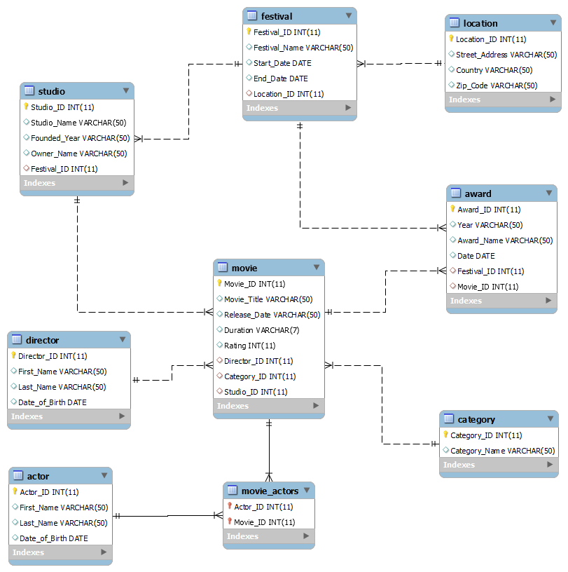

# 🎬 Film Festival Database

A fully relational database system designed to manage movies, actors, directors, studios, film festivals, and awards. Built using SQL with a complete ERD, DDL schema, and populated sample data.

---

## 📐 Entity Relationship Diagram



---

## 🗂️ Database Schema

The database consists of **9 tables** with fully enforced foreign key relationships:

| Table | Description |
|:---|:---|
| `Location` | Stores street address, country, and zip code for festival venues |
| `Festival` | Film festivals with start/end dates linked to a location |
| `Studio` | Production studios with founding year, owner, and festival participation |
| `Movie` | Movies with title, release year, duration, rating, director, category, and studio |
| `Actor` | Actor profiles with name and date of birth |
| `Director` | Director profiles with name and date of birth |
| `Category` | Movie genres (e.g. Drama, Horror, Action/Adventure) |
| `Movie_Actors` | Junction table linking actors to movies (many-to-many) |
| `Award` | Awards given to movies at specific festivals |

---

## 🔗 Relationships

- A **Festival** takes place at a **Location**
- A **Studio** participates in a **Festival**
- A **Movie** belongs to a **Studio**, **Director**, and **Category**
- An **Actor** can appear in many **Movies** (and a Movie can have many Actors)
- An **Award** is given to a **Movie** at a **Festival**

---

## 📁 Files

| File | Description |
|:---|:---|
| `DDL.sql` | Creates all 9 tables with primary keys, foreign keys, and constraints |
| `DML.sql` | Inserts sample data — 10 records per table |
| `ERD.png` | Visual diagram of all tables and their relationships |
| `Report.docx` | Full project report and documentation |

---

## 🚀 How to Run

1. Open your SQL environment (MySQL, SQL Server, or compatible)
2. Run `DDL.sql` first to create the tables
3. Run `DML.sql` to populate the tables with sample data
4. Start querying!

**Example queries to try:**
```sql
-- Get all movies with their director and category
SELECT m.Movie_Title, m.Release_Year, m.Rating,
       d.First_Name, d.Last_Name AS Director,
       c.Category_Name
FROM Movie m
JOIN Director d ON m.Director_ID = d.Director_ID
JOIN Category c ON m.Category_ID = c.Category_ID;

-- Find all awards won by a specific movie
SELECT m.Movie_Title, a.Award_Name, a.Year, f.Festival_Name
FROM Award a
JOIN Movie m ON a.Movie_ID = m.Movie_ID
JOIN Festival f ON a.Festival_ID = f.Festival_ID;

-- List actors and the movies they appeared in
SELECT a.First_Name, a.Last_Name, m.Movie_Title
FROM Movie_Actors ma
JOIN Actor a ON ma.Actor_ID = a.Actor_ID
JOIN Movie m ON ma.Movie_ID = m.Movie_ID;
```

---

## 🛠️ Built With


---

## 👤 Author

**Hitham** — [GitHub](https://github.com/hitham86) · [LinkedIn](https://www.linkedin.com/in/hitham-hauter)
